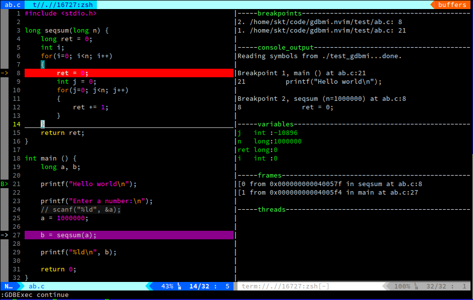

# gdbmi.nvim

## description
This is a plugin for neovim to integrate with GDB. The project is under heavy development.

## inspire

+ [lldb.nvim](https://github.com/critiqjo/lldb.nvim)

## thanks

+ [hues](https://github.com/prashnts/hues): provide the convenience method to colorize the text in terminal
